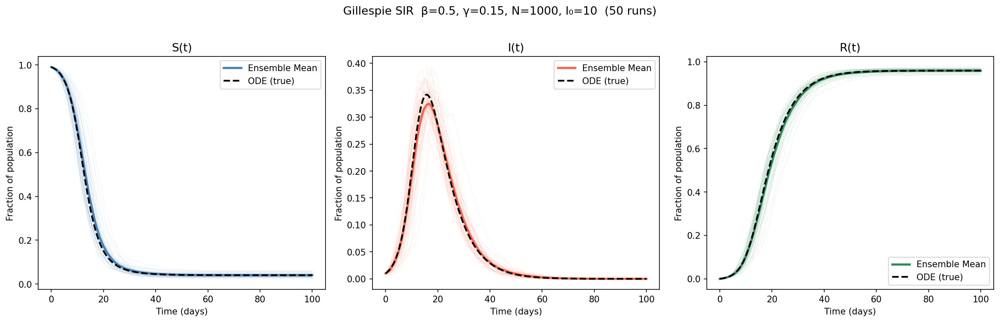
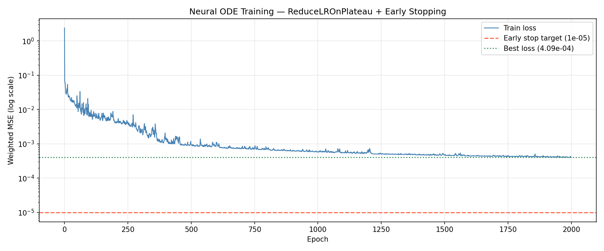
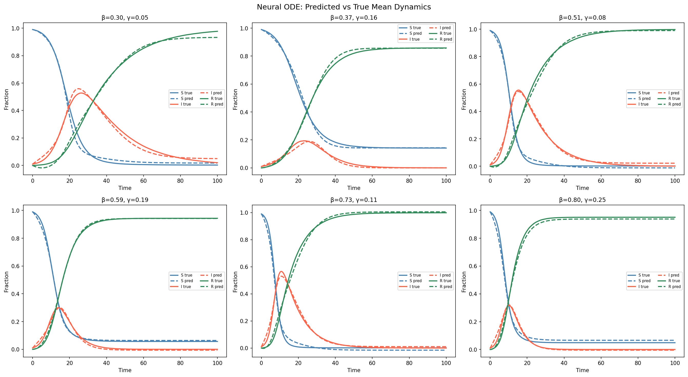
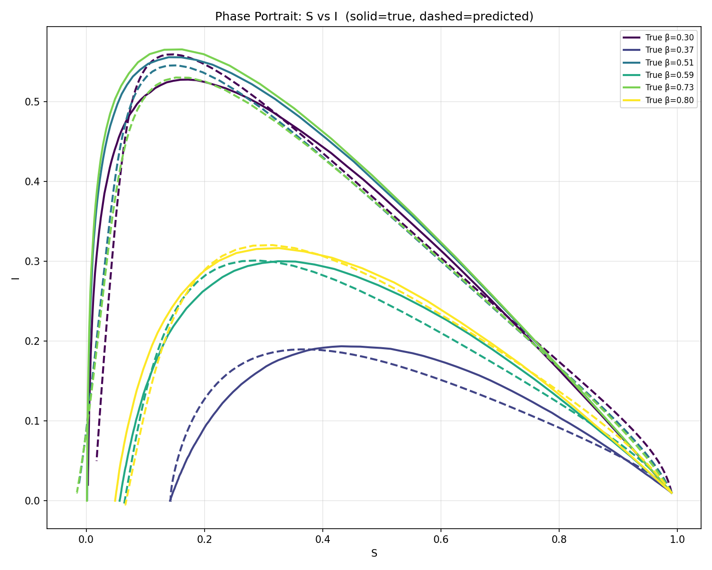
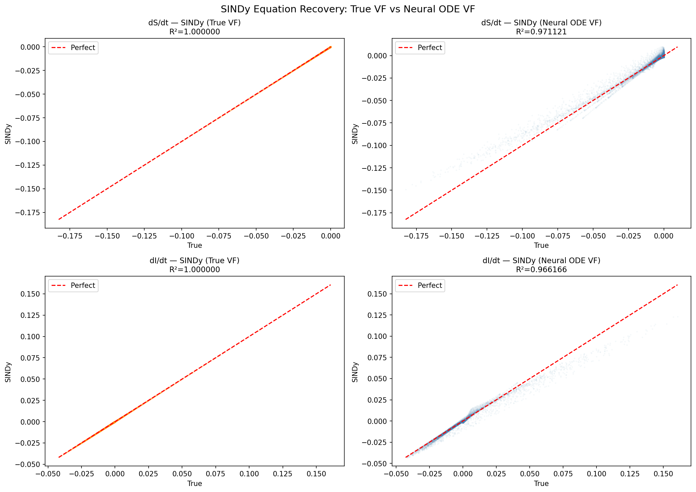

# PySR and SINDy Comparison on SIR Model

## Project Overview
This repository investigates equation recovery mechanisms. The architecture contrasts Symbolic Regression with SINDy. The objective centers on deducing equations from population dynamics.

## Dataset Generation
The pipeline initiates with the Gillespie algorithm. This procedure simulates SIR dynamics. The simulation produces arrays for Susceptible, Infected, and Recovered populations. Interpolation maps these functions onto time grids. The routine computes ensemble means over 200 simulation runs for transmission and recovery parameters.

## Neural ODE Training
A perceptron network models the vector field. The network accepts state variables and parameters. The pass outputs state derivatives. A layer enforces conservation laws by subtracting row means.

The optimizer minimizes mean squared error. The function assigns weights to the Infected channel to counteract imbalances. The scheduler adjusts learning rates.

## Equation Recovery Process

### PySR Implementation
PySR applies genetic programming to discover expressions. The script passes the state variables and the Neural ODE derivatives into the regressor. The algorithm explores combinations of addition, subtraction, and multiplication operators. PySR generates a Pareto front of equations, balancing complexity and error.

### SINDy Implementation
SINDy frames equation discovery as a regression problem. The script constructs a matrix of functions, including polynomials and cross-terms. Least squares optimization isolates the coefficients. The procedure iterates across thresholds to identify terms that govern the dynamics.

## Method Comparison
The workflow executes recovery algorithms on ground truth derivatives and Neural ODE derivatives.

PySR requires hyperparameter tuning for population size and parsimony constraints. PySR discovers operators without assumptions about structures.

SINDy requires a function library. The method executes matrix operations to yield coefficients. SINDy isolates the terms when the basis functions encompass the dynamics. The Neural ODE supplies gradients that enable SINDy to bypass differentiation of data.
